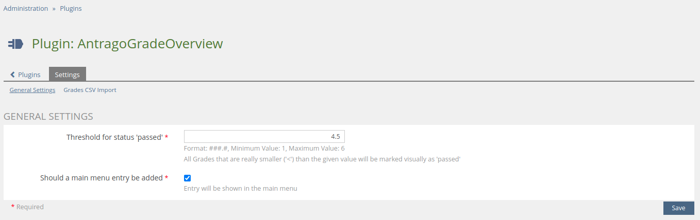
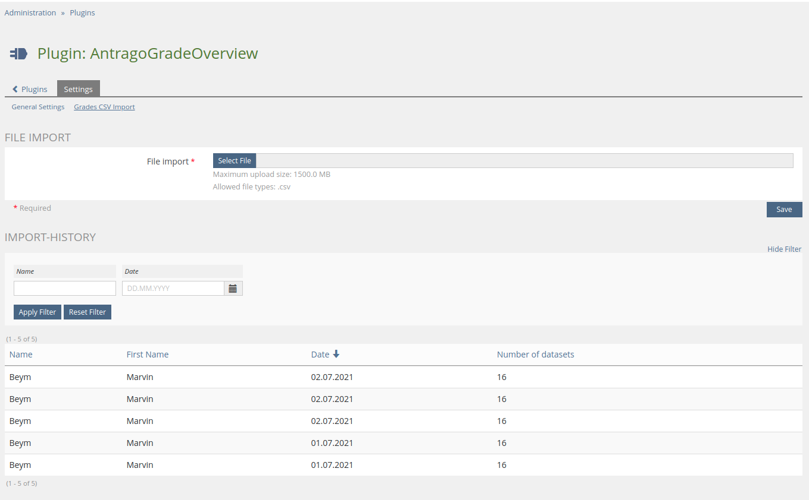
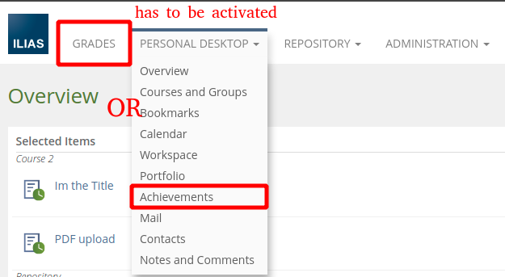
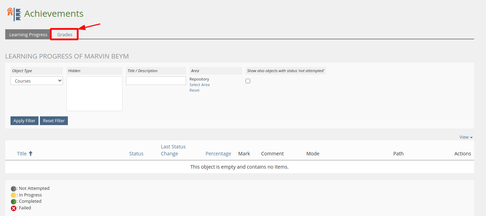
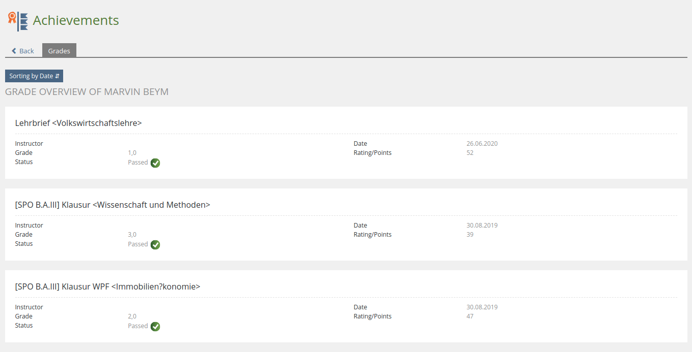
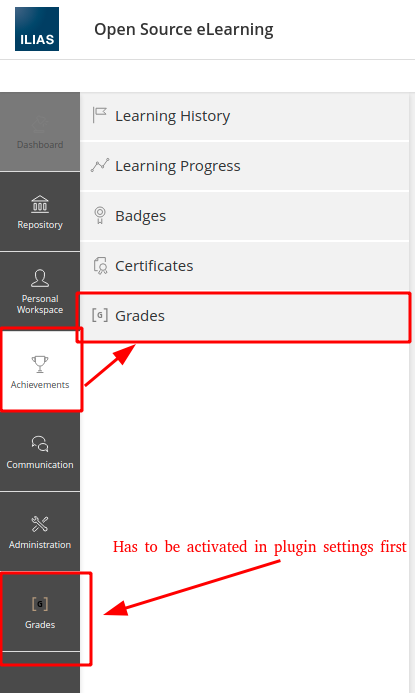
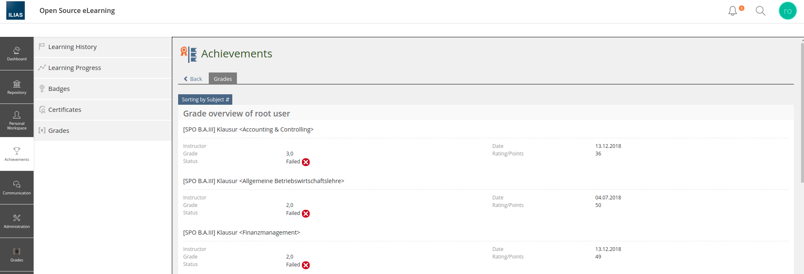

# UIHook Plugin - AntragoGradeOverview

* PHP: [](https://php.net/) [](https://php.net/)

* ILIAS: [](https://ilias.de/) [](https://ilias.de/)

---
## Table of contents

- [UIHook Plugin - AntragoGradeOverview](#uihook-plugin---antragogradeoverview)
   * [Notes](#notes)
   * [Images](#images)
   * [Description](#description)
   * [Installation](#installation)
   * [Usage](#usage)
   * [Licence](#licence)

---

## Notes

The **CSV** file has to have a specific layout.   
See https://redmine-intern.office.databay.de/issues/13746 (**leistungsnachweisescheine-Bsp.csv**)

Each new upload overrides all currently stored grades (Database table gets cleared)

---

## Images

<details>
<summary>General settings</summary>


</details>

<details>
<summary>Grades CSV Import</summary>


</details>

<details>
<summary>Grades overview</summary>
   <details>
   <summary>Ilias 5.4</summary>
   
   
   
   
   </details>

   <details>
   <summary>Ilias 6.x and 7.x</summary>
   
   
   
   </details>
</details>

---

## Description

Adds a grade overview where grades can be imported using a csv file.

---

## Installation

1. Clone this repository to **Customizing/global/plugins/Services/UIComponent/UserInterfaceHook/AntragoGradeOverview**
2. Install the Composer dependencies
   ```bash
   cd Customizing/global/plugins/Services/UIComponent/UserInterfaceHook/AntragoGradeOverview
   composer install --no-dev
   ```
   Developers **MUST** omit the `--no-dev` argument.


3. Login to ILIAS with an administrator account (e.g. root)
4. Select **Plugins** in **Extending ILIAS** inside the **Administration** main menu.
5. Search for the **AntragoGradeOverview** plugin in the list of plugin and choose **Install** from the **Actions** drop
   down.
6. Choose **Activate** from the **Actions** dropdown.

---

## Usage

1. Open the plugin configuration
2. Open the **Grades CSV Import** Tab and upload a .csv file.
3. In the table below a new entry will be added that shows the import history.
4. See [Images](#images) on where to find Grades overview for your account based on the ILIAS version

---

## License

See LICENSE file in this repository.
